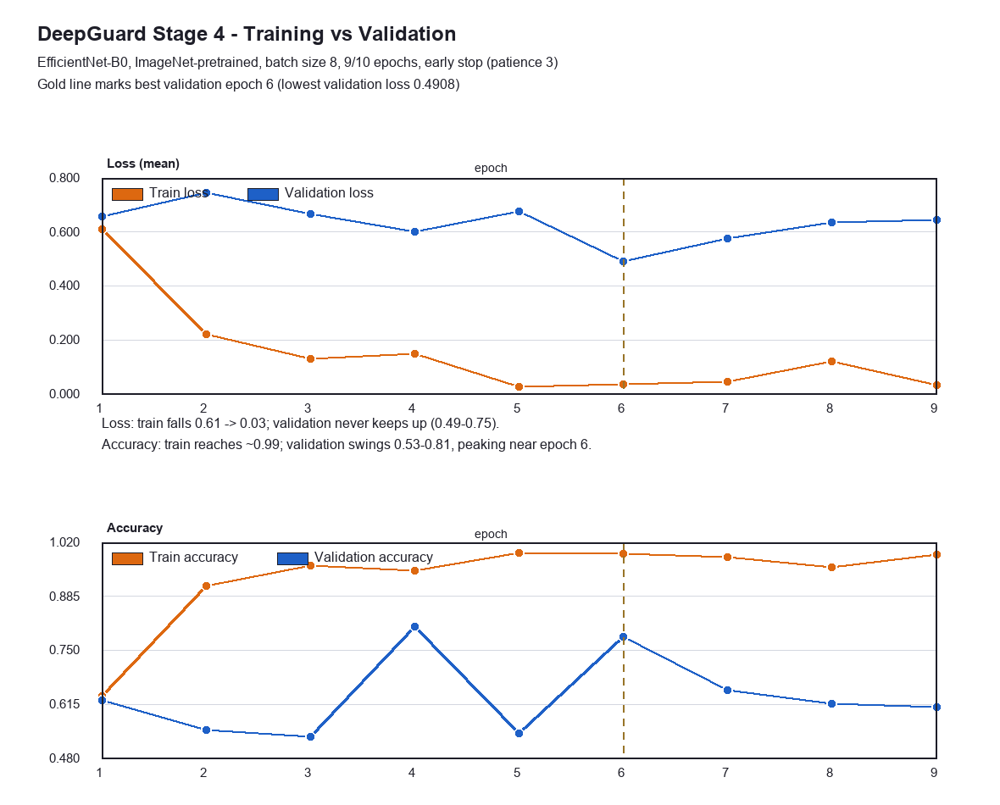
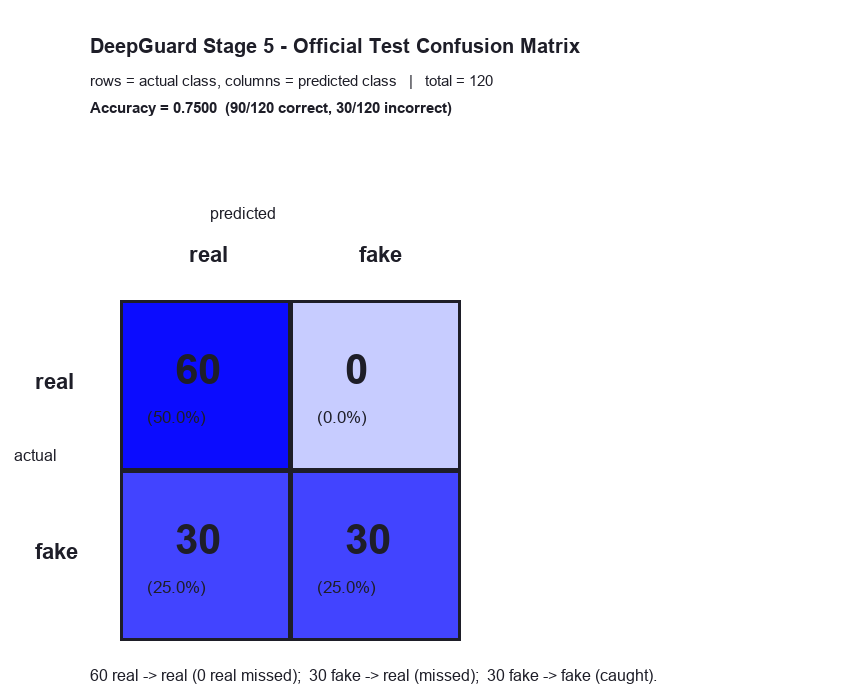
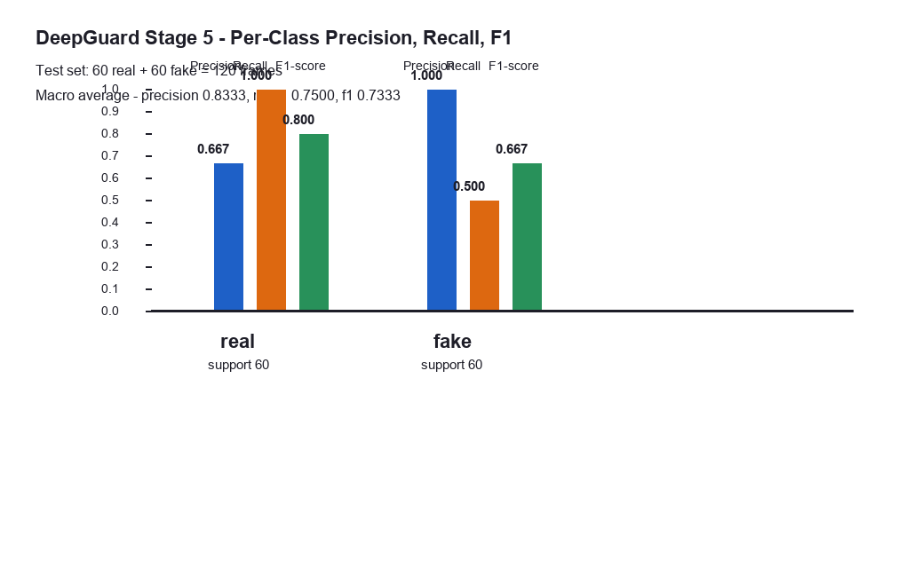
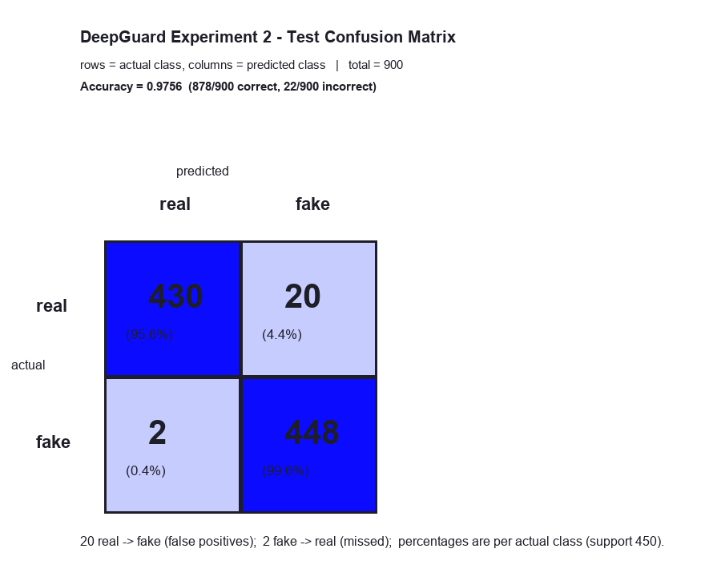
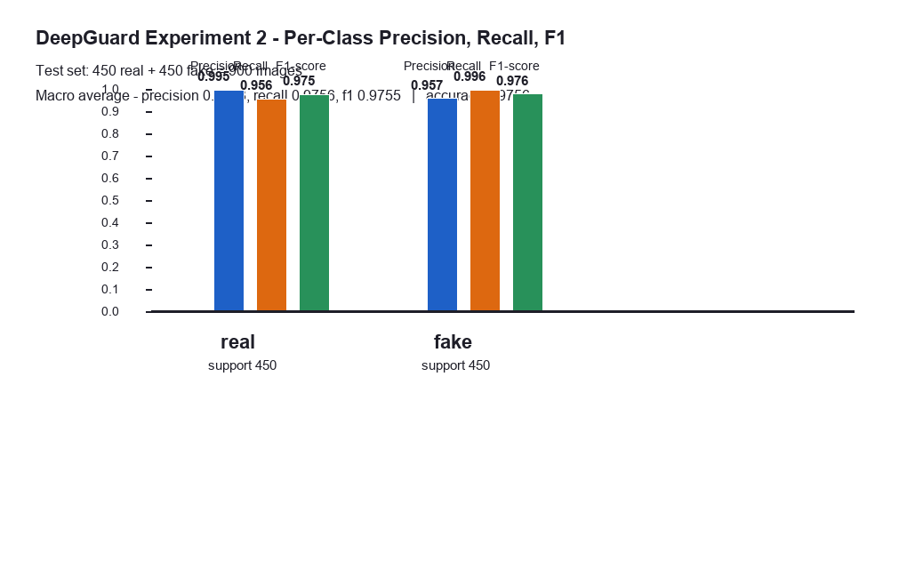
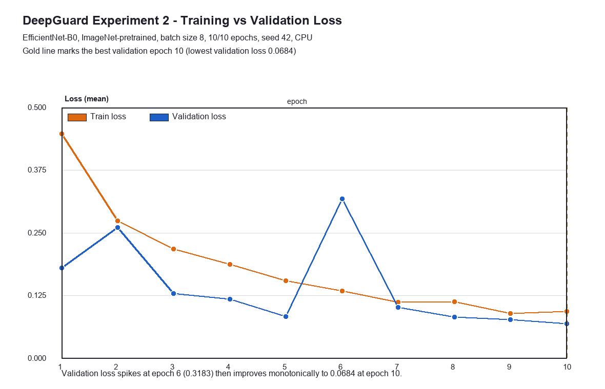
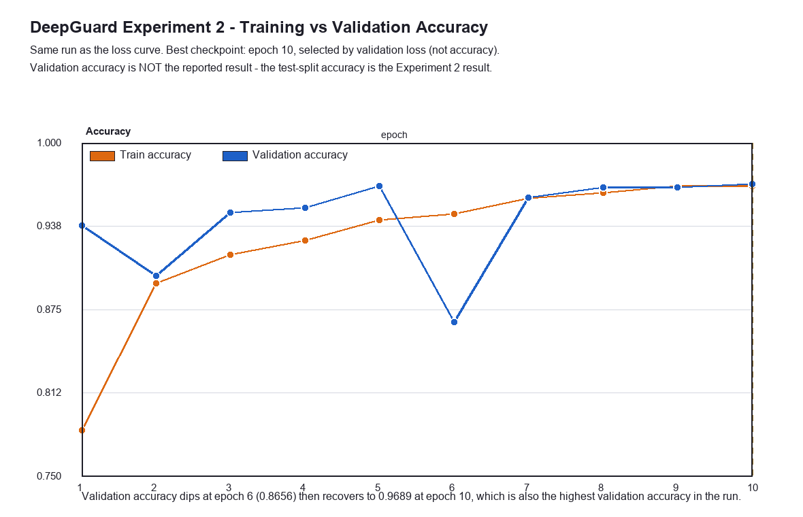

# DeepGuard - Final Technical Report

## AI-Based Deepfake Detection Prototype

**Project:** Deepfake Technology
**Project ID:** 24CGCS06
**Department:** Electronics and Communication Engineering (ECE)
**Semester:** V (5th Semester)
**Institution:** Atria Institute of Technology, Bengaluru
**Project Guide:** Prof. Jayanth U
**Student Name:** [Student Name]
**University / College Register Number:** [Register Number]
**Date of Submission:** [Submission Date]

> **Title-page note.** The student name, register number and submission date are
> not present in the verified project artifacts, so placeholders are used.
> Everything else on this page (project ID 24CGCS06, department ECE, semester 5,
> institution, and project guide "Prof. Jayanth U") is taken from the project's
> official README and the Streamlit application (`app.py`).

---

# DeepGuard: AI-Based Deepfake Detection Prototype

## Final Technical Report - Project Documentation Stage 7

> **Document purpose.** This report consolidates the verified technical work of
> DeepGuard Stages 1-6 into a single document suitable for SIP/thesis-style
> submission. Every number, table and claim in this report is traced to a real
> project artifact (see **Appendix A - Evidence Traceability**). No new
> experiment was performed to write this report, and no value has been invented,
> estimated or copied from any external source. Where information is not
> available in the verified project artifacts, this is stated explicitly rather
> than assumed.

> **Two experiments are documented.** Sections 1-25 and Appendix B describe
> **Experiment 1**, the original academic baseline, whose artifacts are frozen
> and unmodified. The separately headed section *"Experiment 2 - Larger,
> Differently Distributed Dataset"* (placed after Section 17) documents a second,
> independent experiment. **Experiment 2 does not replace, supersede or
> invalidate Experiment 1.** Both sets of results, checkpoints and evidence files
> are retained. The authoritative Experiment 2 source is
> `reports/experiment_2_report.md`, backed by the machine-readable artifacts
> listed in **Appendix A**.

---

## Table of Contents

1. Abstract
2. Introduction
3. Societal Context and Problem Statement
4. Objectives
5. Scope
6. Technical Background and Literature Review
7. Methodology and System Architecture
8. Dataset
9. Preprocessing Pipeline
10. Data Splitting and Leakage Control
11. Model Architecture
12. Training Configuration
13. Training Results
14. Validation Analysis
15. Test Evaluation Methodology
16. Test Results
17. Error Analysis
- **Experiment 2 - Larger, Differently Distributed Dataset** (separate experiment; does not replace Experiment 1)
18. Limitations
19. Responsible AI
20. Application Status and Future Integration
21. Testing and Quality Assurance
22. Reproducibility
23. Conclusion
24. Future Work
25. References
26. Appendix A - Evidence Traceability
27. Appendix B - Dataset Documentation Discrepancy

> **Reading note.** Sections 8-17 and 18 (item 1-7) describe **Experiment 1**.
> The Experiment 2 section is self-contained and carries its own dataset,
> training, evaluation, checkpoint and limitations subsections.

---

## 1. Abstract

DeepGuard is an academic prototype that investigates image-based deepfake
detection for the project "Deepfake Technology" (Project ID 24CGCS06), aligned
with SDG 10 (Reduced Inequalities) and its digital-governance concerns. The
project builds an end-to-end pipeline: frame extraction from a small
FaceForensics++ (c23, Deepfakes method) subset, deterministic and
leakage-free data preparation, fine-tuning of an ImageNet-pretrained
EfficientNet-B0 classifier (a two-class head `real = 0`, `fake = 1`) on a
CPU-only machine, and a held-out test-set evaluation.

The trained model (best checkpoint, epoch 6) was evaluated **once** on the
untouched 120-frame test split and reached an accuracy of **75.00%**, with
**0 false alarms** (fake precision 100.00%) but only half of the fake frames
detected (fake recall 50.00%). This is a first-prototype experiment on a
small, single-identity-component test set; the result is reported honestly with
its limitations and is **not** claimed to be optimal, state of the art, or
generalised beyond the prepared data. The report also records a dataset
documentation discrepancy (600 frames on disk versus the 1,200 originally
documented) transparently rather than silently correcting it.

**Experiment 2 (supplementary).** A second, independently documented experiment
was subsequently carried out on a substantially larger and **differently
distributed** dataset: a 6,000-image class-balanced subset of the Kaggle *140k
Real and Fake Faces* dataset (3,000 real FFHQ photographs, 3,000 StyleGAN-generated
fakes), split 4,200 / 900 / 900 with seeded deterministic selection, MD5 and
64-bit perceptual-hash de-duplication, and six passing build audits. An
ImageNet-pretrained EfficientNet-B0 was fine-tuned on CPU for 10 epochs (600.47
minutes, best epoch 10) and evaluated **once** on the untouched 900-image test
split, reaching an **Experiment 2 test accuracy of 97.56%** with a **macro F1 of
97.55%** and confusion matrix `[[430, 20], [2, 448]]`.

**Experiment 2 is not a controlled dataset-size-only experiment.** It changed the
data amount, the fake-generation method and family (FaceForensics++ face-swap
versus StyleGAN synthesis), image framing, source resolution, compression
characteristics and test-set size (120 versus 900) **simultaneously**. The
difference between the two experiments therefore **cannot be attributed solely
to the increase in dataset size**, and no such claim is made anywhere in this
report. Experiment 1 remains the frozen academic baseline.

---

## 2. Introduction

Deepfake technology synthesises or manipulates facial video content. Rapidly
improving generation methods make manipulated media increasingly difficult to
distinguish from genuine content by eye, which raises concerns about identity
fraud, misinformation and digital trust. This project develops a prototype that
takes a first, honest step towards automated detection: a reproducible
image-classification pipeline that trains a lightweight model on real
prepared data and evaluates it on a held-out test split.

The project was executed in documented stages:

| Stage | Description | Status |
| --- | --- | --- |
| Stage 1 | Input validation and image preprocessing prototype (Streamlit UI) | Completed |
| Stage 2 | Dataset selection, research and preparation; frame extraction | Completed |
| Stage 3 | Model architecture selection (EfficientNet-B0) | Completed |
| Stage 4 | Training pipeline and a real training run | Completed |
| Stage 5 | Official test-set evaluation | Completed |
| Stage 6 | Results analysis and visualization | Completed |
| Stage 7 | Final consolidated technical report (this document) | Completed |
| Stage 8 | Final review, presentation and submission preparation | Completed |

> **Note on the README.** When this section was first written, the project
> README still listed Stages 4-6 as "not executed", having been written before
> training had produced a checkpoint. The README has since been updated to
> document both completed experiments. The verified stage records listed above
> remain authoritative for this report.

---

## 3. Societal Context and Problem Statement

A field visit carried out for this project identified concerns related to
deepfake-related cybercrime, identity fraud, misinformation, the difficulty of
verifying digital content, and limited public awareness of deepfake risks. The
project is registered under SDG 10 (Reduced Inequalities) because manipulated
media and the inability to verify digital content disproportionately enable
fraud and disinformation against individuals and vulnerable groups.

**Problem statement.** Modern deepfake generators produce convincing facial
media. Manual verification is unreliable, and professional-grade detectors
require large datasets and heavy compute. This project addresses the specific,
realistic problem of building a small, CPU-trainable, image-based binary
classifier (real vs. fake) with an honest experimental protocol, so that the
prototype's claims match its evidence.

---

## 4. Objectives

1. Study publicly available deepfake datasets and select a realistic one for a
   student prototype (documented in `docs/dataset_research.md`).
2. Prepare a small, balanced, leakage-free train/validation/test dataset from
   real downloaded video material.
3. Select a model architecture that fits a 224 x 224 input pipeline and a
   CPU-only training machine (documented in
   `docs/model_architecture_research.md`).
4. Implement and run an end-to-end training pipeline (Stage 4) that produces a
   real trained checkpoint.
5. Evaluate the trained model **once** on the held-out test split with standard
   metrics (accuracy, precision, recall, F1, confusion matrix).
6. Document every result with a trace to its source artifact, and keep
   validation and test results strictly separate.
7. (Added for Experiment 2) Evaluate the same architecture under a
   substantially larger, independently sourced dataset with a **different
   distribution of fake images**, de-duplicated and audited for leakage, and
   report the outcome **without** attributing the difference from Experiment 1 to
   dataset size alone.

---

## 5. Scope

**In scope.** Image-based binary classification (real vs. fake) of frames
extracted from a small FaceForensics++ subset (Deepfakes method at c23
compression). Training, validation and a single independent test evaluation are
within scope.

**Also in scope (Experiment 2).** The same architecture and the same honest
protocol, applied to a 6,000-image subset of an independently published dataset
whose fake class is **StyleGAN-generated** rather than face-swapped. This
evaluates DeepGuard under a **substantially larger and differently distributed
dataset**. Because several dataset properties change together, Experiment 2 is
reported as a **second evaluation under different conditions**, and explicitly
**not** as a dataset-size ablation.

**Out of scope and explicitly not claimed.**

- Video-level / temporal detection (only frames are processed).
- Generalisation to other manipulation methods (Face2Face, FaceSwap,
  NeuralTextures, FaceShifter), other datasets (e.g. Celeb-DF, DFDC), different
  compression levels, or "in the wild" internet media.
- Audio or multimodal analysis.
- A production-ready or state-of-the-art detector.
- Any performance claim derived from published numbers other than the 
  architecture survey in `docs/model_architecture_research.md` (those are
  ImageNet values reported by the cited authors, not DeepGuard results).

---

## 6. Technical Background and Literature Review

The technical background is compiled from the project's own research documents
(`docs/dataset_research.md`, `docs/model_architecture_research.md`). The
references section lists the sources cited there.

### 6.1 Facial-manipulation technology

Deepfakes are produced by face-swapping or face-reenactment pipelines,
including non-learned and GAN-based methods. Public benchmarks such as
FaceForensics++ (FF++) provide original ("real") sequences and manipulated
("fake") versions created with four automated methods (Deepfakes, Face2Face,
FaceSwap, NeuralTextures; FaceShifter was added later), at several compression
levels (raw, c23, c40).

### 6.2 Detector architectures

Image-based detection is usually framed as a binary classification task on
faces or frames. Relevant published architectures compiled in the project's
research document:

| Architecture | Params | FLOPs | Native input | ImageNet top-1 (published) | Source |
| --- | --- | --- | --- | --- | --- |
| **EfficientNet-B0** | 5.3M | 0.39B | 224 x 224 | 77.1% | Tan & Le 2019 |
| MobileNetV3-Large | 5.4M | 0.22B | 224 x 224 | 75.2% | Howard et al. 2019 |
| ResNet-50 | ~26M | 4.1B | 224 x 224 | 76.0% | He et al. 2015 |
| Xception | ~23M | 8.4B | 299 x 299 | 79.0% | Chollet 2017 |
| ViT-B/16 | ~86M | - | 224 x 224 | 77.9% | Dosovitskiy et al. 2020 |

These ImageNet numbers are **published values reported by the original
authors** for general object classification; they are not deepfake-detection
numbers and are **not** DeepGuard benchmark results.

### 6.3 Selection rationale

EfficientNet-B0 was selected for the specific project facts:

1. Native 224 x 224 input, matching the existing Stage 1 preprocessing exactly.
2. 5.3M parameters / 0.39B FLOPs - roughly 10x lighter than ResNet-50, the
   decisive factor on a CPU-only laptop (Intel Core i5-8250U, no NVIDIA GPU).
3. Official ImageNet pretrained weights ship with TorchVision for transfer
   learning.
4. EfficientNet backbones appear in published deepfake-detection work (cited in
   `docs/model_architecture_research.md`), making the choice defensible.
5. ResNet-50 was documented as the alternative / fallback.

---

## 7. Methodology and System Architecture

The prototype pipeline (implemented stages in green in the app; the trained
model is built on top of the Stage 1 input path):

```
Input image/video frame
   -> Validation (extension, size, image integrity)        [Stage 1: src/validation.py]
   -> Preprocessing (BGR->RGB, resize 224x224, 0-1 norm)   [Stage 1: src/preprocessing.py]
   -> Model input tensor  (1, 3, 224, 224), normalised     [Stage 6: src/inference.py]
   -> Model: EfficientNet-B0 (2-class head)                [Stage 4: src/training.py]
   -> Classifier logits  (1, 2): real=0, fake=1           [trained checkpoint]
   -> Prediction + model confidence                        [Stage 6 module: src/inference.py]
```

The project deliberately separates concerns into modules that can be imported
independently and tested without the deep-learning stack:

| Module | Responsibility |
| --- | --- |
| `config.py` | Central configuration (paths, seed 42, ratios, labels, image size, hyperparameters) |
| `src/validation.py` | Uploaded-file validation for the Streamlit app |
| `src/preprocessing.py` | App-side display preprocessing (cv2 decode, resize, 0-1 normalise) |
| `src/dataset.py` | Raw scan, group-aware splits, processed copy, summary, leakage audits |
| `src/extraction.py` | Deterministic frame extraction from FF++ videos with provenance manifest |
| `src/model_interface.py` | Reporting of the selected architecture and expected checkpoint location |
| `src/training.py` | Dataset, transforms, model, one-epoch loops, early stopping, checkpoint saving |
| `src/evaluation.py` | Test-set evaluation; pure-Python metric functions |
| `src/inference.py` | Real single-image prediction building block (not yet wired into the app) |
| `train_model.py` | CLI entry point for Stage 4 training |
| `evaluate_model.py` | CLI entry point for Stage 5 test evaluation |
| `prepare_dataset.py` | CLI entry point for dataset preparation |
| `extract_dataset_frames.py` | CLI entry point for frame extraction |
| `app.py` | Streamlit user interface (input, validation, preprocessing, dataset/model status) |

The framework decision was verified: **PyTorch (torch 2.14.0, torchvision
0.29.0, CPU-only)** because PyTorch publishes Python-3.14 Windows wheels, while
TensorFlow stable does not support Python 3.14 on Windows. Training runs in a
separate `venv-train` environment so the Streamlit application environment is
never disturbed.

---

## 8. Dataset

### 8.1 Source material

The dataset was built from downloaded **FaceForensics++** material (Deepfakes
method, c23 compression), kept intact under `data/faceforensics`:

- `original_sequences/youtube/c23/videos` -> the **real** class
- `manipulated_sequences/Deepfakes/c23/videos` -> the **fake** class

Verified contents: **20 MP4 videos** (10 original + 10 manipulated), spanning
10 identity sequences.

### 8.2 Frame extraction

`extract_dataset_frames.py` + `src/extraction.py` decoded **30 deterministic,
evenly-spaced frames per video** (no randomness; indices are identical every
run) using OpenCV's bundled FFmpeg decoder, writing PNG via Pillow:

- 10 real videos x 30 frames = **300 real frames**
- 10 fake videos x 30 frames = **300 fake frames**
- Total = **600 raw frames**

Every frame lives in an identity-component sub-folder (same component id in
both class folders), e.g.
`183_253__183_253__frame_000012.png`, and a provenance manifest
(`data/raw/frames_provenance.json`) records source video, label, identities and
frame index for every frame. Nothing synthetic is created.

### 8.3 Dataset summary (verified on disk)

| Class | Raw valid PNGs | Train | Validation | Test |
| --- | --- | --- | --- | --- |
| Real | 300 | 180 | 60 | 60 |
| Fake | 300 | 180 | 60 | 60 |
| **Total** | **600** | **360** | **120** | **120** |

Corrupt/unsupported files: **0**. Inverse check: total processed = 600.

Identity components on disk: **183_253, 469_481, 585_599, 672_720, 866_878**.
Split-to-component assignment (verified, no overlap):

| Split | Components | Count |
| --- | --- | --- |
| Train | 469_481, 585_599, 672_720 | 360 |
| Validation | 866_878 | 120 |
| Test | 183_253 | 120 |

> **Dataset discrepancy - see Appendix B.** Early documentation stated 600 real
> / 600 fake / 1,200 total. Repeated disk verification shows **300 + 300 = 600
> frames** (verified identical across multiple checks). All counts in this
> report use the verified disk values; the limitation is recorded, not
> silently corrected.

---

## 9. Preprocessing Pipeline

Two preprocessing paths exist and are kept distinct.

### 9.1 App display path (`src/preprocessing.py`, verified)

1. Decode the uploaded file with OpenCV.
2. Convert colour order from BGR to RGB.
3. Resize to **224 x 224** pixels.
4. Normalise pixel values from 0-255 to **0-1** (for display).
5. Add a batch dimension, giving an array of shape (1, 224, 224, 3).

This path **prepares** the image; it does not decide real/fake.

### 9.2 Training / inference path (verified in `src/training.py` and `src/inference.py`)

- **Training transforms** (train split only): RandomResizedCrop(224, scale
  0.8-1.0), RandomHorizontalFlip (p=0.5), RandomRotation (+/-10 deg), ToTensor,
  ImageNet mean/std normalisation. Kept deliberately light so subtle forensic
  traces are not destroyed.
- **Evaluation transforms** (validation and test splits): deterministic
  Resize(224) + CenterCrop(224), ToTensor, ImageNet normalisation
  (mean 0.485/0.456/0.406, std 0.229/0.224/0.225).

`src/inference.py` reproduces the evaluation transforms exactly, producing an
input tensor of shape **(1, 3, 224, 224)** - matching the training pipeline.

The app also validates uploads (`src/validation.py`): supported extensions
JPG/JPEG/PNG, non-empty, <= 25 MB, dimensions within 32-12000 px, and safe PIL
image-integrity checks, raising a friendly `ImageValidationError`.

---

## 10. Data Splitting and Leakage Control

`prepare_dataset.py` + `src/dataset.py` implement **group-aligned,
identity-aware splitting**:

- Frames are grouped by **identity component** (the connected component of the
  target/source graph formed by the manipulated videos, e.g. `183_253` and
  `253_183` link identities 183 and 253).
- The **same component id exists in both class folders**, so the splitter keeps
  a whole identity inside exactly one split.
- Ratios used: 70% / 15% / 15%, **seed 42** (deterministic), with
  `--max-per-class` limiting each class to an equal number (prototype subset).

Verified leakage audit results:

- Train / validation / test path sets are **disjoint** (overlap counts 0/0/0).
- No identity component appears in more than one split.
- The test split (component **183_253**, including original videos 183.mp4 and
  253.mp4 and manipulated videos 183_253.mp4 and 253_183.mp4) is **absent
  from train and validation**, and was never touched during training.

---

## 11. Model Architecture

- **Primary:** EfficientNet-B0, ImageNet-pretrained (`EfficientNet_B0_Weights.IMAGENET1K_V1`),
  with the final classification head replaced by `Linear(1280 -> 2)`.
- **Alternative (documented):** ResNet-50 (fallback if EfficientNet-B0 proved
  too slow to fine-tune; not trained in this project).
- **Input:** 224 x 224 x 3, ImageNet-normalised.
- **Label mapping (fixed, used by training and inference):** `real = 0`,
  `fake = 1`; the positive class for evaluation is **fake**.
- **Framework:** PyTorch 2.14.0 + TorchVision 0.29.0, CPU only.

Verified checkpoint metadata
(`models/deepguard_efficientnet_b0.pt`, 16,341,163 bytes):

| Field | Value |
| --- | --- |
| model_name | efficientnet_b0 |
| num_classes | 2 |
| class_names | ["real", "fake"] |
| label_to_index | {"real": 0, "fake": 1} |
| image_size | [224, 224] |
| epoch | 6 |
| validation_loss | 0.4907777428627014 |
| validation_accuracy | 0.7833333333333333 |
| seed | 42 |
| torch_version | 2.14.0+cpu |

A model-load sanity check confirmed the checkpoint rebuilds into the correct
architecture and a forward pass on a dummy input has shape **(1, 3, 224, 224)
-> (1, 2)**. This is a structural sanity check of loading and architecture
compatibility; it is **not** a prediction and no accuracy value derives from it.

---

## 12. Training Configuration

Configuration actually used in the recorded Stage 4 run (from the verbatim
console log `reports/stage6/train_run_log.txt`; planned defaults live in
`config.py`):

| Setting | Value used |
| --- | --- |
| Architecture | EfficientNet-B0 (ImageNet pretrained) |
| Input size | 224 x 224 |
| Batch size | **8** (overridden from the planned default 16) |
| Optimizer | AdamW |
| Learning rate | 3e-4 |
| Weight decay | 1e-4 |
| Loss | CrossEntropyLoss |
| LR schedule | ReduceLROnPlateau (factor 0.1, patience 2, on validation loss) |
| Max epochs | 10 (requested) |
| Early stopping | patience 3 on validation loss |
| num_workers | 0 |
| Seed | 42 |
| Device | CPU (no CUDA) |
| Validation | deterministic eval transforms, `shuffle=False` |
| Training duration | **52 min 28 s** |

> **Honesty note.** These are the settings of the **first reproducible
> prototype experiment** to verify the pipeline end to end. They are planned,
> conservative defaults and are **not claimed to be optimal**. No hyperparameter
> search or tuning was performed.

---

## 13. Training Results

Complete recorded epoch history (verbatim from `reports/stage6/train_run_log.txt`;
**training/validation values only - these are NOT test results**):

| Epoch | Train Loss | Train Accuracy | Val Loss | Val Accuracy |
| --- | --- | --- | --- | --- |
| 1 | 0.6099 | 0.6361 | 0.6585 | 0.6250 |
| 2 | 0.2206 | 0.9111 | 0.7458 | 0.5500 |
| 3 | 0.1317 | 0.9611 | 0.6652 | 0.5333 |
| 4 | 0.1489 | 0.9500 | 0.5997 | 0.8083 |
| 5 | 0.0261 | 0.9944 | 0.6748 | 0.5417 |
| 6 | 0.0362 | 0.9917 | 0.4908 | 0.7833 |
| 7 | 0.0469 | 0.9833 | 0.5771 | 0.6500 |
| 8 | 0.1215 | 0.9583 | 0.6341 | 0.6167 |
| 9 | 0.0335 | 0.9889 | 0.6448 | 0.6083 |

**Best checkpoint (lowest validation loss): epoch 6** - validation loss 0.4908,
validation accuracy 78.33% (values also recorded in the checkpoint metadata).

Early stopping triggered after epoch 9 (validation loss did not improve at
epochs 7, 8, 9). Training completed **9 of 10** requested epochs.

**Figure 1 - Training curves** (train/validation loss and accuracy per epoch,
generated from the record above; see `reports/stage6/training_curves.png`).



---

## 14. Validation Analysis

Observations about the recorded training/validation values (validation split =
component 866_878, 120 frames):

- Training loss fell from 0.6099 (epoch 1) to roughly 0.03-0.12 for epochs 5-9;
  training accuracy reached >= 95.00% by epoch 3 (peak 99.44% at epoch 5). The
  recorded history is consistent with the model fitting the training split very
  closely.
- Validation loss never dropped below ~0.49 (best 0.4908 at epoch 6) and
  fluctuated (0.49 - 0.75) across epochs rather than tracking training loss.
- Validation accuracy fluctuated substantially (53.33% - 80.83%) with no
  monotonic trend; the best validation accuracy (80.83%, epoch 4) and the
  best-checkpoint epoch (6, by lowest validation loss) do not coincide.
- The gap between near-perfect training metrics and fluctuating validation
  metrics is consistent with a persistent train/validation performance gap.
  This is an observation on a small validation split, not proof of overfitting.
- Variance caveat: the validation split contains **one identity component
  (866_878)**, so a single frame changing label moves accuracy by ~0.008; this
  small, single-source split partly explains the epoch-to-epoch swings.

**Training/validation values are optimisation signals. They are never presented
as test results anywhere in this project.**

---

## 15. Test Evaluation Methodology

`evaluate_model.py` + `src/evaluation.py` implement the **official Stage 5
evaluation**:

- Performed **once** on the **held-out test split only** (component 183_253,
  60 real + 60 fake = **120 frames**), which was never used during training.
- Model rebuilt from the checkpoint and placed in `eval` mode; weights come
  exclusively from the checkpoint (`torch.load(..., weights_only=True)`).
- Deterministic evaluation transforms, `shuffle=False`, `torch.no_grad()`.
- Metric functions (`compute_confusion_matrix`, `compute_metrics`) are plain
  Python using standard definitions:
  precision = TP/(TP+FP), recall = TP/(TP+FN), F1 = harmonic mean.
- Metrics computed and written to `reports/evaluation_report.json`
  (generated 2026-09-22T20:19:05, device: cpu, torch 2.14.0+cpu).

---

## 16. Test Results

### 16.1 Overall result

| Metric | Value |
| --- | --- |
| Test samples | 120 |
| Accuracy | **75.00%** (90 / 120 correct) |
| Incorrect | 30 / 120 |
| Macro precision | 83.33% |
| Macro recall | 75.00% |
| Macro F1 | 73.33% |
| Positive class | fake |

### 16.2 Per-class metrics

| Class | Precision | Recall | F1-score | Support |
| --- | --- | --- | --- | --- |
| real | 66.67% | 100.00% | 80.00% | 60 |
| fake | 100.00% | 50.00% | 66.67% | 60 |

### 16.3 Confusion matrix (rows = actual, columns = predicted)

| | Predicted real | Predicted fake |
| --- | --- | --- |
| **Actual real** | 60 | 0 |
| **Actual fake** | 30 | 30 |

**Figure 2 - Confusion matrix** (`reports/stage6/confusion_matrix.png`).



**Figure 3 - Per-class metrics** (`reports/stage6/per_class_metrics.png`).



---

## 17. Error Analysis

- **False positives (real predicted as fake): 0.** No real frame was flagged as
  fake - the model never raised a false alarm on this test set.
- **False negatives (fake predicted as real): 30.** Half of the 60 fake frames
  were missed and classified as real. This is the dominant failure mode.
- Class behaviour:
  - **Fake precision = 100.00%**: every frame the model called "fake" was fake
    (30/30) - high trust when it raises an alarm.
  - **Fake recall = 50.00%**: of 60 fake frames, only 30 were caught.
- Precision and recall measure different properties and must not be conflated: a
  model can have perfect fake precision while missing half the fakes - exactly
  the recorded behaviour.
- Practical meaning: the detector is **conservative (silent rather than
  false-alarming)**, but the 30 missed fakes are the safety-relevant direction
  for a deepfake detector. These statements describe only the 120-frame test
  set.

---

# Part II - Experiment 2

## Experiment 2 - Larger, Differently Distributed Dataset

> **Status and relationship to Experiment 1.** Experiment 2 is a **separate,
> supplementary experiment**. It does **not** replace, supersede, invalidate or
> re-score Experiment 1. Experiment 1 (Sections 8-17) remains the **frozen
> academic baseline** of this project: its 600-frame FaceForensics++ dataset,
> 360/120/120 split, checkpoint `models/deepguard_efficientnet_b0.pt` and
> `reports/evaluation_report.json` are unmodified. Both checkpoints and both sets
> of evidence files are retained in the repository.
>
> **Authoritative sources.** Everything below is transcribed from
> `experiments/experiment_2_large_dataset/dataset_report.json`,
> `…/training_summary.json` and `…/reports/evaluation_report.json`. The
> companion narrative report is `reports/experiment_2_report.md`. **No new
> training, evaluation or metric generation was performed for this document.**

### Purpose

Experiment 1 established what the architecture achieves on a minimal,
single-source dataset, and where it fails. Experiment 2 asks a different
question: **what does the same architecture achieve on a substantially larger,
independently sourced dataset whose synthetic images are produced by a
different generative family?**

It was carried out to test whether the Experiment 1 weakness - very poor fake
recall (50.00%) - was an artefact of a 360-image training set, or a more
fundamental property of the approach. The answer recorded below is that the
weakness was substantially relieved under the new conditions. It is **not**
claimed that dataset size alone produced that change.

### Dataset and source

| Property | Value (verified) |
| --- | --- |
| Dataset | Kaggle `xhlulu/140k-real-and-fake-faces` (v2) |
| URL | `https://www.kaggle.com/datasets/xhlulu/140k-real-and-fake-faces` |
| Licence | Kaggle "Other (specified in description)"; underlying FFHQ photographs are CC BY-NC-SA 4.0 (NVIDIA) - non-commercial, attribution required. **No images are redistributed by this repository.** |
| Source pool | **140,000** images |
| Official pool split | 50,000 / 50,000 train, 10,000 / 10,000 validation, 10,000 / 10,000 test |
| Real class | FFHQ facial photographs (NVIDIA) |
| **Fake class** | **StyleGAN-generated faces** (not FaceForensics++ manipulations) |
| Image properties | all JPEG, RGB, 256 x 256 |
| Selected subset | **6,000** images (3,000 real + 3,000 fake), 164.7 MB |

Experiment 2 **inherits the publisher's official `train` / `valid` / `test`
folders**; no image ever crosses that boundary. This is recorded in the dataset
report as the split policy and is enforced by a passing audit check.

### The 6,000-image selection

Selection was **deterministic and seeded** (`seed: 42`), not arbitrary. The
builder (`build_dataset.py`) performs five stages and **copies nothing until
every check has passed**:

1. **Scan** the six official folders (140,000 images).
2. **Exact-duplicate removal (MD5)** - byte-identical images collapse to one.
   Same class and split -> keep one; same class across splits -> keep the copy
   in the higher-priority split (`test` > `validation` > `train`), which removes
   any leakage the source dataset introduced; **conflicting labels -> drop every
   copy**.
3. **Near-duplicate removal (pHash)** - 64-bit DCT perceptual hash; see below.
4. **Deterministic subsampling** to the per-class quotas using a per-pool seed
   derived from `--seed 42`.
5. **Audit** (see below).

The selection is pinned by a **dataset fingerprint** - a SHA-256 over the
manifest's `split/label/md5` rows:

```
cafc017380d10484326d668e2893f3582ddeb8c5e23c278569804d7e44f3d8bb
```

`train_experiment_2.py` recomputes this fingerprint at startup and refuses to
resume against a changed dataset, so the recorded training run is provably tied
to exactly this 6,000-image dataset.

### Split (70 / 15 / 15)

| Split | Real | Fake | Total | Share | Drawn only from |
| --- | --- | --- | --- | --- | --- |
| Train | 2,100 | 2,100 | **4,200** | 70.0% | `train_real`, `train_fake` |
| Validation | 450 | 450 | **900** | 15.0% | `valid_real`, `valid_fake` |
| Test | 450 | 450 | **900** | 15.0% | `test_real`, `test_fake` |
| **Total** | **3,000** | **3,000** | **6,000** | 100% | 140,000-image pool |

Every split is class-balanced. The test split was used for the single recorded
evaluation only and never for training, tuning or model selection.

### Duplicate and leakage controls

**Exact duplicates (MD5):** **0** removed. No file is byte-identical to another
anywhere in the 140,000-image pool, and no MD5 appears in two splits.

**Near-duplicates (64-bit pHash, threshold 3 bits):**

| Measure | Value |
| --- | --- |
| Images scanned | 140,000 |
| **Near-duplicates removed** | **5,069** |
| Total removed | 5,069 |
| Unreadable / corrupt images | **0** |

Two images within **3 bits** of Hamming distance are treated as near-duplicates
and the later one dropped. Candidate pairs are found by cutting the hash into
`threshold + 1` disjoint bands (multi-index hashing), which is exact for
distances up to the threshold - no false negatives.

| Pair | Minimum cross-split pHash distance | Against threshold of 3 |
| --- | --- | --- |
| `train` <-> `validation` | **4 bits** | passes, margin of 1 bit |
| `train` <-> `test` | **4 bits** | passes, margin of 1 bit |
| `validation` <-> `test` | **6 bits** | passes, margin of 3 bits |

> **Honest qualification.** Two of the three margins are a single bit. The
> no-leakage guarantee is **threshold-relative**, not comfortable; a stricter
> threshold could have flagged borderline pairs.

**Build audits - 6 of 6 passed:**

| Audit check | Meaning | Result |
| --- | --- | --- |
| `exact_counts_match_quota` | every split has exactly the requested count | passed |
| `classes_balanced_in_every_split` | real count equals fake count in each split | passed |
| `no_exact_duplicate_across_splits` | no MD5 appears in two splits | passed |
| `no_image_labelled_both_real_and_fake` | no contradictory labels | passed |
| `experiment_split_maps_to_one_official_split` | no image crosses the official boundary | passed |
| `no_near_duplicate_across_splits` | minimum cross-split pHash distance greater than 3 bits | passed |

The builder and the validator both exit non-zero if any check fails.

### Training configuration and duration

Configuration actually used, from `training_summary.json`:

| Setting | Value used |
| --- | --- |
| Architecture | EfficientNet-B0, ImageNet-pretrained |
| Input size | 224 x 224 |
| Framework | PyTorch 2.14.0+cpu, CPU only (no CUDA) |
| Batch size | 8 |
| Learning rate / weight decay | 3e-4 / 1e-4 |
| Loss | CrossEntropyLoss |
| Max epochs requested / completed | 10 / 10 |
| Early stopping | patience 3 on validation loss - **not triggered** |
| Seed | 42 |
| **Best epoch** | **10** (lowest validation loss) |
| **Training duration** | **600.47 minutes** (approximately 10.0 hours, CPU) |

**Checkpoint information:**

| Property | Value |
| --- | --- |
| Checkpoint file | `models/experiment_2_deepguard_efficientnet_b0.pt` |
| Size | 16,346,305 bytes (approximately 16.3 MB), committed with ordinary Git |
| Saved from epoch | 10 - the epoch with the lowest validation loss |
| Dataset fingerprint verified at training start | yes |

Experiment 1 and Experiment 2 use **separate checkpoint files**. Experiment 2 does
not overwrite, replace or modify `models/deepguard_efficientnet_b0.pt`.

### Test evaluation

- Performed **once** on the **untouched 900-image test split** (450 real + 450
  fake), never used during training or model selection.
- Model rebuilt from the checkpoint in `eval()` mode; weights come exclusively
  from the checkpoint. Deterministic evaluation transforms, `shuffle=False`,
  `torch.no_grad()`.
- Metrics written to
  `experiments/experiment_2_large_dataset/reports/evaluation_report.json`
  (generated 2026-10-04T07:37:44, device `cpu`, torch 2.14.0+cpu), using the same
  `evaluate_model.py` / `src/evaluation.py` metric definitions as Experiment 1.
- The evaluation was pointed at the Experiment 2 reports directory, so
  Experiment 1's frozen `reports/evaluation_report.json` was never a write
  target.

**Validation versus test - kept strictly separate.**

| Metric | Value | Role |
| --- | --- | --- |
| Best validation loss | 0.0684 (`0.06835601629805751`) | checkpoint-selection signal |
| Best validation accuracy | 96.89% (`0.9688888888888889`) | checkpoint-selection signal |
| **Test accuracy** | **97.56%** (`0.9755555555555555`) | **the reported result** |

Validation figures were used to select the best checkpoint and are therefore
**not** the reported result. **97.56% is Experiment 2's TEST accuracy.**

**Demonstration predictions are a third, separate category.** A prediction shown
by the running Streamlit application is a **live single-image model output**. It
is not part of any official evaluation and is never quoted as one.

### Test results

| Metric | Value |
| --- | --- |
| Test samples | 900 |
| **Accuracy** | **97.56%** (878 / 900 correct) |
| Incorrect | 22 / 900 |
| Macro precision | 97.63% |
| Macro recall | 97.56% |
| **Macro F1** | **97.55%** |
| Positive class | fake |

**Per-class metrics**

| Class | Precision | Recall | F1-score | Support |
| --- | --- | --- | --- | --- |
| real | 99.54% | 95.56% | 0.9751 | 450 |
| fake | 95.73% | 99.56% | 0.9760 | 450 |

**Confusion matrix (rows = actual, columns = predicted)**

| | Predicted real | Predicted fake |
| --- | --- | --- |
| **Actual real** | 430 | 20 |
| **Actual fake** | 2 | 448 |

Equivalently `[[430, 20], [2, 448]]`: **20 false positives** (real called fake),
**2 false negatives** (fake called real), 878 correct.

**Figure 4 - Experiment 2 test confusion matrix** (rows = actual class, columns
= predicted class, over the 900-image test split; cell shading is relative to
each actual class; rendered from `experiments/experiment_2_large_dataset/reports/evaluation_report.json`;
see `experiments/experiment_2_large_dataset/reports/confusion_matrix.png`).



**Figure 5 - Experiment 2 per-class precision, recall and F1** (test split, 450
real + 450 fake; macro precision 0.9763, macro recall 0.9756, macro F1 0.9755;
see `experiments/experiment_2_large_dataset/reports/per_class_metrics.png`).



**Figure 6 - Experiment 2 training vs validation loss** (loss per epoch over the
10 completed epochs; the marked line is the best validation epoch, epoch 10 at
validation loss 0.0684, which is the checkpoint that was evaluated; see
`experiments/experiment_2_large_dataset/reports/training_loss_curve.png`).



**Figure 7 - Experiment 2 training vs validation accuracy** (accuracy per epoch
for the same run; the checkpoint was selected by validation **loss**, not
accuracy, and validation accuracy is not the reported result - the reported
result is the 97.56% test-split accuracy; see
`experiments/experiment_2_large_dataset/reports/training_accuracy_curve.png`).



### Experiment 2 error behaviour

The failure direction is the **mirror image** of Experiment 1:

- **False negatives: 2** (was 30). Only 2 of 450 synthetic images were missed -
  the poor fake recall that dominated Experiment 1 is largely resolved.
- **False positives: 20** (was 0). The model now raises false alarms on 20 of
  450 genuine images.
- **Fake recall 99.56%, fake precision 95.73%.** The detector is now **mildly
  biased towards calling an image fake**, where Experiment 1 was biased the
  other way.

Under the balanced test set this costs little accuracy. Under a different
real/fake prior - for example a deployment where most incoming images are
genuine - the 20 false alarms would matter more. The operating threshold is a
plain `argmax` and was never tuned, deliberately, to keep the test set free of
contamination.

### Experiment 2 limitations

1. **Not a controlled dataset-size-only experiment.** See the interpretation
   subsection below; this is the single most important caveat.
2. **Different forgery family.** Experiment 2's fakes are StyleGAN generations,
   not face-swaps. The model has been evaluated against a synthetic-image
   signature it was built for and says nothing about face-swap,
   face-reenactment or any other manipulation family.
3. **No identity metadata.** The dataset publishes **no identity metadata**, so
   identity-level grouping is **not possible**. Leakage control rests on the
   publisher's official split plus de-duplication, not on person-level
   separation. **Experiment 1 had identity-component grouping; Experiment 2 does
   not. This makes Experiment 1's split stricter, not Experiment 2's.**
4. **JPEG / compression artefacts.** All Experiment 2 images are JPEG and carry
   JPEG compression and quantisation artefacts, where Experiment 1's frames were
   `c23`-compressed video stored losslessly as PNG.
5. **Threshold-relative near-duplicate margins.** Minimum cross-split pHash
   distances of 4, 4 and 6 bits against a 3-bit threshold; two margins are a
   single bit.
6. **Best checkpoint at the final epoch - no evidence of a ceiling.** The epoch-10
   checkpoint had the lowest validation loss and validation loss was still
   falling when the 10-epoch budget ran out. The model was probably **not fully
   converged**, so **97.56% must not be read as a ceiling**; a longer run could
   move it in either direction.
7. **Single-source test set.** The 97.56% figure comes from 900 images of one
   publisher's dataset. It must **not** be generalised to all real-world
   deepfake content and does **not** demonstrate generalisation to all deepfakes.
8. **Frame-level only, no calibration.** As with Experiment 1, classification is
   per-frame with no temporal modelling, and the displayed confidence is a raw
   softmax score rather than a calibrated probability.

### Interpretation and comparison with Experiment 1

| Metric (test split) | Experiment 1 - Frozen Baseline | Experiment 2 |
| --- | --- | --- |
| Test images | 120 | 900 |
| Real / fake in test | 60 / 60 | 450 / 450 |
| **Test accuracy** | **75.00%** | **97.56%** |
| Macro F1 | 73.33% | 97.55% |
| Confusion matrix | `[[60, 0], [30, 30]]` | `[[430, 20], [2, 448]]` |
| False positives | 0 | 20 |
| False negatives | 30 | 2 |
| Fake recall | 50.00% | 99.56% |
| Real recall | 100.00% | 95.56% |
| Training time | 52 min 28 s | 600.47 min |
| Checkpoint | `deepguard_efficientnet_b0.pt` | `experiment_2_deepguard_efficientnet_b0.pt` |

> **Experiment 2 cannot be interpreted as a pure dataset-size experiment.**
> Experiment 1 and Experiment 2 differ in **six dimensions simultaneously**:
>
> 1. **Data amount** - 600 images (360 train) versus 6,000 (4,200 train).
> 2. **Fake-generation method and family** - FaceForensics++ **face-swap
>    manipulation** versus **StyleGAN synthesis**.
> 3. **Image framing / distribution** - centre-cropped widescreen frames versus
>    full square 256 x 256 images including background.
> 4. **Source resolution**, and therefore downsampling to the 224 x 224 model
>    input - approximately 3.2x versus approximately 1.14x.
> 5. **Compression characteristics** - `c23`-compressed video stored as PNG
>    versus JPEG compression and quantisation.
> 6. **Test-set size** - 120 images versus 900 images.

**Why dimension 2 dominates the interpretation.** A face-swap inherits the
identity, pose and lighting of a real source photograph, so its artefacts are
blending and boundary inconsistencies layered onto genuine sensor noise. A
StyleGAN image is synthesised end to end, so its artefacts are an entirely
different signature - generator upsampling and spectral regularities. A
detector's difficulty can differ sharply between those two families **on its
own**, independent of training-set size. A meaningful part, potentially most, of
the observed gap may reflect a **differentally easier fake source** rather than
a better-trained model.

**Why dimension 6 matters.** Experiment 1's estimate rests on 120 images and
Experiment 2's on 900, so the two accuracies are **not equally precise** and must
always be presented with that difference stated.

**The correct conclusion, and only this one:**

> Experiment 2 achieved higher test performance than Experiment 1 under its
> specified larger-dataset and independently sourced data conditions, but the
> design does not permit attributing that difference to dataset size alone.
> Experiment 2 evaluates DeepGuard under a substantially larger and differently
> distributed dataset; it is a second evaluation under different conditions, not
> a controlled demonstration of a dataset-size effect.

**Statements that must not be made about this project:**

- "Accuracy improved because the dataset was larger."
- "The 10x larger dataset improved detection."
- Any wording presenting Experiment 2 as a controlled dataset-size experiment.
- Any claim that Experiment 2 shows generalisation to all deepfakes, or that the
  model is perfect or ceiling-limited.

Experiment 1's pattern is also worth stating plainly rather than presenting the
two accuracies as a clean before/after: Experiment 1 flagged **zero** real images
as fake, so its perfect fake precision is an artefact of barely attempting any
fake prediction - it **missed half its fakes** (30 of 60). The two experiments
fail in genuinely different directions.

---

## 18. Limitations

> Items 1-7 below are the limitations of **Experiment 1**, the frozen baseline.
> The limitations of **Experiment 2** - including the mandatory statement that it
> is not a controlled dataset-size-only experiment - are listed separately in
> the *Experiment 2 - Larger, Differently Distributed Dataset* section above.

1. **Dataset size and documentation.** The verified raw dataset contains **600
   frames** (300 real / 300 fake), not the 1,200 frames originally documented.
   All counts in this report use the verified disk values (Appendix B).
2. **Single-component test set.** The test set contains only **120 frames from a
   single identity component (183_253)**, making every test metric noisy and
   single-subject biased.
3. **No generalisation claimed.** Results are specific to this prepared
   dataset/split, the FF++ Deepfakes method, c23 compression, and the exact
   frame sampling. They must not be generalised to other manipulation methods,
   other datasets, or other compression levels.
4. **Frame-level only.** Evaluation is at frame level; temporal information was
   not used, so this does not demonstrate video-level detection performance.
5. **Small sample estimate.** 75.00% accuracy is an estimate with a small
   sample and must be read with that limitation in mind.
6. **First experiment, not optimal.** No hyperparameter tuning or architecture
   search was performed; the configuration is a conservative first-prototype
   setting.
7. **Documentation staleness (since resolved).** Earlier drafts of the project
   README described the pre-training status; the README has since been updated
   to document both experiments, and the verified stage records remain
   authoritative (Section 2).

---

## 19. Responsible AI

- Detection results are treated as **indications requiring further
  verification**, never as absolute proof of authenticity. The dataset research
  and the app UI both state this explicitly.
- No claim of "certainty" is made: `src/inference.py` returns model output as
  **model confidence** and refuses to run when any requirement is missing
  (no random results, no placeholder probabilities).
- All metrics are reported honestly with their limitations; the dataset
  discrepancy and the single-component test set are documented rather than
  hidden.
- The app does **not** display any statistics it cannot source from verified
  data ("Nothing here is estimated or invented").

---

## 20. Application Status and Future Integration

`app.py` (Streamlit) currently implements, and was verified to show:

- Image upload with validation (JPG/JPEG/PNG), preprocessing display
  (resize 224 x 224, RGB, 0-1 normalisation).
- Dataset status read from the real on-disk summary.
- Model/architecture status via `src/model_interface.py` (selected architecture
  EfficientNet-B0, framework value "PyTorch (CPU)", trained model "Not available
  yet" in the app build). *(Historical: the model **is** available now - see
  "Integration status update" below.)*

Verified facts about integration:

- `app.py` explicitly reports steps 5-7 of the pipeline ("AI/ML Model",
  "Classification", "Prediction") as **pending**, and shows the detection result
  as "Not available in the current prototype because the trained deepfake
  detection model has not yet been integrated."
- The app runs in the `venv` environment where PyTorch is intentionally not
  installed; `src/inference.py` is built so that `inference_available()` is
  False there and raises a friendly error rather than a fake prediction.
- **`src/inference.py` is the integration building block**: it can load the
  real checkpoint (`training.build_model`, `pretrained=False`, weights from the
  checkpoint only), preprocess a single image with the exact training pipeline,
  and return `prediction_class` / `confidence` / `probabilities`.

### Integration status update - Experiment 2 checkpoint now served

The description above records the state of the prototype when Experiment 1 was
the only trained model, and is retained as history. **The application has since
been integrated.** The current status is:

| Item | Status |
| --- | --- |
| Checkpoint loaded by the app | `models/experiment_2_deepguard_efficientnet_b0.pt` (Experiment 2) |
| UI steps "AI/ML Model" / "Classification" / "Prediction" | **completed** - real prediction shown |
| Detection result notice | **completed** - real class and confidence returned |
| Model loading | real checkpoint, `pretrained=False`, weights from the checkpoint only |
| Experiment 1 checkpoint | retained at `models/deepguard_efficientnet_b0.pt`, unmodified |
| Streamlit server | verified responding **HTTP 200** |
| UI consistency checks | **28/28 passed** |
| Warm app test suite | **7/7 passed** |

The app now performs genuine inference and returns a real prediction class,
confidence and probability vector. **Which checkpoint is loaded is the only
difference between the two experiments at the application layer**: the serving
code path is shared, and the app was not modified to favour either result.

> **A demo prediction is not an evaluation.** A single image classified by the
> running app is a **live demonstration output**. It is produced with an
> `argmax` threshold, is not calibrated, and forms **no part of** the official
> Experiment 1 (75.00%) or Experiment 2 (97.56%) test results. Those come only
> from the batch evaluations recorded in Sections 16 and the Experiment 2
> section.

---

## 21. Testing and Quality Assurance

Automated verification performed on the completed codebase:

| Suite | Environment | Result |
| --- | --- | --- |
| Core test suite (dataset, evaluation, inference, model_interface, training) | venv-train | **62 tests OK, 1 skipped** |
| Full unit/integration discovery | venv-train | 79 ran, 75 passed, 3 environment-dependent errors*, 1 skipped |
| Full unit discovery | app venv | **92 OK, 15 skipped** |
| Python syntax compile (py_compile) | - | **26 project modules, 0 failures** |

\* The 3 errors (`test_app`, `test_pipeline`, `test_extraction.ExtractionIntegrationTests`)
require `streamlit` / OpenCV, which are deliberately not installed in the
`venv-train` environment; they pass in the app environment. This is by design
(training and app environments are separated) and is not a product defect.

Additional verification performed during the project:

- Dataset counts, split totals and leakage audits re-verified from disk on
  multiple occasions (identical results).
- Checkpoint integrity: loads successfully, 360 tensors, metadata matches the
  training record.
- Stage 6 final verification script: 28/28 consistency checks passed (confusion
  matrix marginals, accuracy 75.00%, per-class and macro derivations,
  checkpoint metadata, 9-epoch history vs. log).
- Evaluation-report metrics verified against the raw confusion matrix.

---

## 22. Reproducibility

| Item | Value |
| --- | --- |
| Operating system | Windows |
| Python | 3.14.7 (both `venv-train` and app `venv`) |
| PyTorch | 2.14.0+cpu (CPU only; CUDA unavailable) |
| TorchVision | 0.29.0+cpu |
| NumPy | 2.5.3 |
| Pillow | 12.3.0 (both environments) |
| OpenCV | 5.0.0 (app environment) |
| Streamlit | 1.64.0 (app environment) |
| Seed | 42 |
| Checkpoint | `models/deepguard_efficientnet_b0.pt` (records model, seed 42, epoch 6, torch version) |

Commands used to produce the verified artifacts:

```
.\venv-train\Scripts\python.exe extract_dataset_frames.py     # Stage 2 (600 frames + manifest)
.\venv-train\Scripts\python.exe prepare_dataset.py            # Stage 2 (group-aware splits)
.\venv-train\Scripts\python.exe train_model.py --batch-size 8 # Stage 4 (9/10 epochs, best epoch 6)
.\venv-train\Scripts\python.exe evaluate_model.py             # Stage 5 (test split, 120 images)
.\venv-train\Scripts\python.exe reports\stage6\generate_stage6_plots.py  # Stage 6 plots
```

Evaluation is deterministic (fixed transforms, no shuffle, CPU). Perfect
bit-for-bit reproducibility across different machines is not claimed.

**Experiment 2 reproducibility record.** Experiment 2 is reproducible from the
same stack plus one added dependency, `imagehash`, and the following commands:

```
.\venv-train\Scripts\python.exe build_dataset.py     # 140,000 -> 6,000, dedupe + 6 audits
.\venv-train\Scripts\python.exe train_experiment_2.py   # 10 epochs, fingerprint-verified
.\venv-train\Scripts\python.exe evaluate_model.py --checkpoint models\experiment_2_deepguard_efficientnet_b0.pt
```

| Experiment 2 item | Value |
| --- | --- |
| Added dependency | `imagehash` |
| Dataset fingerprint (SHA-256) | `cafc017380d10484326d668e2893f3582ddeb8c5e23c278569804d7e44f3d8bb` |
| Checkpoint | `models/experiment_2_deepguard_efficientnet_b0.pt` (epoch 10, seed 42, 16,346,305 bytes) |
| Machine-readable evidence | `experiments/experiment_2_large_dataset/dataset_report.json`, `…/training_summary.json`, `…/reports/evaluation_report.json` |
| Generated plots | `confusion_matrix.png`, `per_class_metrics.png`, `training_loss_curve.png`, `training_accuracy_curve.png` |

**Deployment note.** This report is authored and maintained in Markdown as the
authoritative source. **This note is superseded:** a PDF rendition is also
delivered alongside it as `reports/DeepGuard_SIP_Final_Technical_Report.pdf`. No
PDF-generation dependency has been added to either project environment; the PDF
is produced outside the Python environments, which are deliberately left
unchanged. The Markdown file remains authoritative and the PDF is a
rendering of it.

---

## 23. Conclusion

The DeepGuard prototype successfully demonstrated an honest, reproducible
image-based deepfake-detection workflow on real downloaded data:

- A **600-frame** FaceForensics++ (Deepfakes, c23) dataset was extracted
  deterministically and split 360/120/120 with verified identity-leakage
  control.
- An ImageNet-pretrained **EfficientNet-B0** was fine-tuned on CPU in 52 min
  28 s (9 of 10 epochs, early stopping), producing a real checkpoint
  (best epoch 6, validation loss 0.4908, validation accuracy 78.33%).
- The model was evaluated **once** on the untouched 120-frame test split:
  **accuracy 75.00%**, **0 false alarms** (fake precision 100.00%), but only
  half of the fake frames caught (fake recall 50.00%), macro F1 73.33%.

The training history and test behaviour are consistent with a close fit to the
training split that does not fully transfer to held-out splits. These are the
results of a first-prototype experiment on a small, single-component test
set. **The model is not described as optimal, state of the art, or
production-ready, and the numbers do not generalise beyond the prepared
dataset/split.**

**Experiment 2 conclusion (supplementary).** A second experiment on a 6,000-image
subset of an independently published dataset with a **different fake class**
(StyleGAN synthesis rather than FaceForensics++ face-swap) reached a **97.56%
test accuracy** and **97.55% macro F1** on a 900-image held-out test split, with
2 false negatives and 20 false positives. Dataset selection was deterministic
and seeded, de-duplicated by MD5 and 64-bit pHash, and passed all six build
audits. This shows DeepGuard performs strongly under these larger-dataset and
independently-sourced conditions, and that Experiment 1's weak fake recall was
substantially relieved.

**It does not show that dataset size caused the improvement**, because the two
experiments differ in data amount, forgery family, framing, resolution,
compression and test-set size simultaneously. Experiment 2 is a second
evaluation under different conditions, not a controlled dataset-size study.
Experiment 1 remains the frozen academic baseline; neither experiment is
claimed to be optimal, state of the art, production-ready, or generalisable
beyond its own dataset.

---

## 24. Future Work

1. ~~**Integrate inference into the UI**~~ - **completed.** `src/inference.py` is
   wired into `app.py`, which now serves the Experiment 2 checkpoint and returns
   a real prediction with confidence (verified HTTP 200, 28/28 UI checks, 7/7
   warm app tests).
2. **Enlarge and diversify the dataset**: add more identities, additional FF++
   manipulation methods and compression levels, and (if access is granted)
   cross-dataset tests such as Celeb-DF.
3. **Video-level detection**: use temporal information (frame sequences) rather
   than single frames.
4. **Performance tuning**: hyperparameter search, alternative training
   augmentations, calibration of confidence, and comparison with the documented
   ResNet-50 alternative on the same split (to be reported only after a real
   evaluation).

**Follow-ups specific to Experiment 2** (listed separately so they are not
conflated with the Experiment 1 items above):

5. **Run to convergence.** Validation loss was still falling when the 10-epoch
   CPU budget ran out and the best checkpoint is the final epoch. A longer
   schedule would show whether 97.56% is a stopping artefact.
6. **Run the missing controlled experiment.** Evaluate *both* Experiment 1's
   FaceForensics++ face-swap data and Experiment 2's StyleGAN data **at matched
   dataset size**, or one dataset at two sizes. Only this isolates the dataset
   size variable; the current pair of experiments does not.
7. **Cross-forgery-family generalisation test.** Evaluate the Experiment 2
   checkpoint on FaceForensics++ manipulations it never saw, and the Experiment
   1 checkpoint on StyleGAN images, to measure forgery-family transfer directly.
8. **Strengthen near-duplicate margins.** Re-run the build at a lower pHash
   threshold than 3 bits, since two of the three cross-split margins are only a
   single bit above it.
9. **Calibrate confidence.** Convert the raw softmax score into a calibrated
   probability before it is shown to end users, and choose the operating
   threshold against an explicit cost of false alarms versus missed fakes.
5. **Robustness and generalisation studies**: test on unseen generators and
   "in the wild" media, and document the results honestly with the same
   evidence-traceability discipline used in this report.

---

## 25. References

The following sources are those already cited inside the project's verified
research documents (`docs/model_architecture_research.md`,
`docs/dataset_research.md`); they are included here for completeness:

1. Tan, M. & Le, Q. V. (2019). "EfficientNet: Rethinking Model Scaling for
   Convolutional Neural Networks". arXiv:1905.11946. https://arxiv.org/abs/1905.11946
2. He, K., Zhang, X., Ren, S. & Sun, J. (2015). "Deep Residual Learning for
   Image Recognition". arXiv:1512.03385. https://arxiv.org/abs/1512.03385
3. Chollet, F. (2017). "Xception: Deep Learning with Depthwise Separable
   Convolutions". arXiv:1610.02357. https://arxiv.org/abs/1610.02357
4. Howard, A. et al. (2019). "Searching for MobileNetV3". arXiv:1905.02244.
   https://arxiv.org/abs/1905.02244
5. Dosovitskiy, A. et al. (2020). "An Image is Worth 16x16 Words: Transformers
   for Image Recognition at Scale". arXiv:2010.11929. https://arxiv.org/abs/2010.11929
6. Roessler, A. et al. (2019). "FaceForensics++: Learning to Detect Manipulated
   Facial Images". arXiv:1901.08971. https://arxiv.org/abs/1901.08971
7. Thing, V. L. L. (2023). "CNN vs Transformers for Deepfake Detection".
   arXiv:2304.03698. https://arxiv.org/abs/2304.03698
8. "SoK: Benchmarking Deepfake Detectors under Adversarial Settings" (2024).
   arXiv:2401.04364. https://arxiv.org/abs/2401.04364
9. Celeb-DF dataset. arXiv:1909.12962. https://github.com/yuezunli/celeb-deepfakeforensics
10. DFDC dataset. arXiv:2006.07397. https://ai.facebook.com/datasets/dfdc
11. DF40 dataset. arXiv:2406.13495. https://github.com/YZY-stack/DF40
12. WildDeepfake. arXiv:2101.01456. https://github.com/xingjunm/wild-deepfake
13. "140k Real and Fake Faces". https://www.kaggle.com/datasets/xhlulu/140k-real-and-fake-faces
14. TorchVision model documentation: https://github.com/pytorch/vision
15. PyTorch release compatibility matrix:
    https://github.com/pytorch/pytorch/blob/main/RELEASE.md
16. TensorFlow tested build configurations:
    https://www.tensorflow.org/install/source

---

## Appendix A - Evidence Traceability

Every substantive claim in this report maps to a verified artifact:

| Claim / Table | Source artifact (verified) |
| --- | --- |
| Project metadata (ID 24CGCS06, ECE, SDG 10, guide) | `README.md`, `app.py` |
| Selection rationale / published ImageNet numbers | `docs/model_architecture_research.md` |
| Dataset research / trade-offs | `docs/dataset_research.md` |
| 20 MP4 videos, 600 raw frames | Disk inspection of `data/faceforensics` + `data/raw`; `data/raw/frames_provenance.json` |
| Raw 300/300, splits 180/180, 60/60, 60/60 | `data/processed/dataset_summary.json` + repeated disk counts |
| Components 183_253 / 469_481 / 585_599 / 672_720 / 866_878 | `data/raw/frames_provenance.json`, `data/processed` folder names |
| Training config (batch 8, lr 3e-4, seed 42, etc.) | `reports/stage6/train_run_log.txt`, `config.py` |
| 9-epoch history table | `reports/stage6/train_run_log.txt` (verbatim), `reports/stage6/generate_stage6_plots.py` assertions |
| Best epoch 6, val loss 0.4908, val acc 78.33% | Checkpoint metadata `models/deepguard_efficientnet_b0.pt` |
| Test metrics (75.00%, CM [[60, 0], [30, 30]], per-class/macro) | `reports/evaluation_report.json` (2026-09-22T20:19:05) |
| 90 correct / 30 incorrect; FP 0; FN 30 | Derived from the confusion matrix in `reports/evaluation_report.json` |
| Model-load sanity (1,3,224,224)->(1,2) | Verified forward-pass check of the checkpoint-rebuilt model |
| Test suites results | venv-train / venv `unittest` runs (75 passed, 92 OK, etc.) |
| 26 modules, 0 compile failures | `py_compile` run over project modules |
| Application status ("not yet integrated") | `app.py` source (sections 3-4, detection result notice) - *historical; the app now performs real inference, see Section 20* |

**Experiment 2 traceability.** Every Experiment 2 figure in this report maps to
a machine-readable artifact under `experiments/experiment_2_large_dataset/`:

| Claim / Table | Source artifact (verified) |
| --- | --- |
| Dataset identity, URL, licence, 140,000-image pool, official fold sizes, all-JPEG 256x256 properties | `dataset_report.json` - `source`; `experiments/experiment_2_large_dataset/README.md` |
| Seed 42; 6,000-image subset; 3,000 real / 3,000 fake; 164.7 MB; 172,652,155 bytes | `dataset_report.json` - `selected`, `configuration.seed` |
| Split 4,200 / 900 / 900, per-class 2,100/450/450, 70/15/15 | `dataset_report.json` - `selected.counts`, `configuration.per_class_quotas`, `configuration.split_policy` |
| 5,069 near-duplicates removed; 0 unreadable; 0 exact duplicates; pHash threshold 3 | `dataset_report.json` - `deduplication`, `configuration.phash_threshold` |
| Minimum cross-split pHash distances 4 / 4 / 6 bits | `dataset_report.json` - `min_cross_split_phash_distance` |
| 6 of 6 build audits passed | `dataset_report.json` - `audit`, `audit_passed` |
| Mandatory "not a controlled dataset-size experiment" caveat | `dataset_report.json` - `distribution_caveat` |
| Dataset fingerprint `cafc0173...d8bb` | `training_summary.json` - `dataset_fingerprint` |
| EfficientNet-B0, CPU, batch 8, lr 3e-4, weight decay 1e-4, patience 3, seed 42, 10/10 epochs | `training_summary.json` - `model_name`, `device`, `batch_size`, `learning_rate`, `weight_decay`, `patience`, `seed`, `epochs_requested`, `epochs_completed` |
| Best epoch 10; best validation loss 0.06835601629805751; not early-stopped | `training_summary.json` - `best_epoch`, `best_validation_loss`, `stopped_early` |
| Training duration 600.47 minutes | `training_summary.json` - `wall_clock_minutes_this_run` |
| Checkpoint `models/experiment_2_deepguard_efficientnet_b0.pt`, 16,346,305 bytes, epoch 10 | `training_summary.json` - `checkpoint_path`; on-disk file size |
| Test accuracy 0.9755555555555555, macro precision 0.9763176638176638, macro recall 0.9755555555555555, macro F1 0.9755457738651017, per-class metrics | `experiments/experiment_2_large_dataset/reports/evaluation_report.json` - `metrics` |
| Confusion matrix `[[430, 20], [2, 448]]` | `evaluation_report.json` - `confusion_matrix` |
| Best validation accuracy 0.9688888888888889 (selection signal, not the reported result) | `evaluation_report.json` - `checkpoint_validation_accuracy` |
| Confusion matrix and per-class metric plots | `experiments/experiment_2_large_dataset/reports/confusion_matrix.png`, `per_class_metrics.png` |
| Training loss / accuracy curves | `experiments/experiment_2_large_dataset/reports/training_loss_curve.png`, `training_accuracy_curve.png` |
| Experiment 2 narrative, comparison and caveats | `reports/experiment_2_report.md` (companion report) |
| Experiment 2 methodology and honest caveats | `experiments/experiment_2_large_dataset/README.md` |

**Two Experiment 2 artifacts that do not exist** (stated rather than implied):
`dataset_validation.json` and a committed processed/training state directory are
absent because the 6,000-image build output and the 16.3 MB checkpoint's training
tree are kept out of Git. Every Experiment 2 number above therefore traces to a
committed JSON report rather than to a re-runnable intermediate file.

## Appendix B - Dataset Documentation Discrepancy

> This appendix concerns **Experiment 1 only**. The Experiment 2 dataset has its
> own separate provenance and audit record, documented in the Experiment 2
> section and traced in Appendix A.

- **Documented claim:** early project documentation/headers state 600 real /
  600 fake = **1,200 frames**.
- **Verified reality:** repeated disk verification (multiple independent counts)
  shows **300 real + 300 fake = 600 frames**, and a processed dataset of 600
  images (360/120/120). No second 600-image batch was ever generated, and the
  raw folders contain exactly 600 PNGs across the 5 listed components.
- **Handling:** recorded, not silently corrected. All counts in this report use
  the **verified** disk values. This is treated as a provenance/documented
  limitation of the dataset, not as a defect in the extraction or preparation
  code (the code and its outputs were re-verified and are internally
  consistent).

---

*End of DeepGuard Final Technical Report (Stage 7). This report documents two
separate experiments: **Experiment 1**, the frozen academic baseline (600
FaceForensics++ frames, 360/120/120, 75.00% test accuracy), and **Experiment 2**,
a supplementary evaluation on a larger, differently distributed dataset (6,000
Kaggle 140k images, 4,200/900/900, 97.56% test accuracy). Experiment 2 does not
replace Experiment 1, and the difference between them is not attributable to
dataset size alone. All values verified against project artifacts; no new
experiment, training, evaluation, or dataset change was performed to produce this
report.*